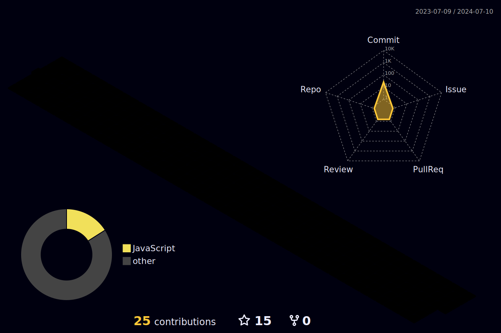

## 🌐 Socials:
   

## 💻 Tech Stack:

![PiKVM](https://img.shields.io/badge/PIKVM-1e394e?logo=data:image/svg%2bxml;base64,PD94bWwgdmVyc2lvbj0iMS4wIiBzdGFuZGFsb25lPSJubyI/Pgo8IURPQ1RZUEUgc3ZnIFBVQkxJQyAiLS8vVzNDLy9EVEQgU1ZHIDIwMDEwOTA0Ly9FTiIKICJodHRwOi8vd3d3LnczLm9yZy9UUi8yMDAxL1JFQy1TVkctMjAwMTA5MDQvRFREL3N2ZzEwLmR0ZCI+CjxzdmcgdmVyc2lvbj0iMS4wIiB4bWxucz0iaHR0cDovL3d3dy53My5vcmcvMjAwMC9zdmciCiB3aWR0aD0iNzAwLjAwMDAwMHB0IiBoZWlnaHQ9IjcwMC4wMDAwMDBwdCIgdmlld0JveD0iMCAwIDcwMC4wMDAwMDAgNzAwLjAwMDAwMCIKIHByZXNlcnZlQXNwZWN0UmF0aW89InhNaWRZTWlkIG1lZXQiPgo8bWV0YWRhdGE+CkNyZWF0ZWQgYnkgcG90cmFjZSAxLjExLCB3cml0dGVuIGJ5IFBldGVyIFNlbGluZ2VyIDIwMDEtMjAxMwo8L21ldGFkYXRhPgo8ZyB0cmFuc2Zvcm09InRyYW5zbGF0ZSgwLjAwMDAwMCw3MDAuMDAwMDAwKSBzY2FsZSgwLjEwMDAwMCwtMC4xMDAwMDApIgpmaWxsPSIjMDAwMDAwIiBzdHJva2U9Im5vbmUiPgo8cGF0aCBkPSJNNjc1MSA2NDQ0IGMtNDggLTI3IC0xNjggLTYwIC0yNDYgLTY5IC0yNyAtMyAtNjYgLTcgLTg1IC0xMCAtMjQ4Ci0zMyAtNTIxIC0zNyAtMjY0MCAtNDEgLTEwNzAgLTEgLTE5NzIgLTUgLTIwMDUgLTggLTIxMyAtMTcgLTIxOSAtMTggLTM0NQotMzYgLTExMiAtMTcgLTEwOSAtMTYgLTIxNiAtNDQgLTMyMyAtODYgLTU3NiAtMjQyIC03NzkgLTQ4MSAtNTYgLTY2IC0xNTUKLTIxMCAtMTU1IC0yMjUgMCAtNSAtNCAtMTAgLTggLTEyIC00IC0xIC0zMCAtNDggLTU4IC0xMDMgLTkwIC0xNzkgLTE1NSAtMzgzCi0xNzAgLTU0MCAtMTAgLTEwMSAtMTEgLTI3NSAtMiAtMzEwIDQgLTE2IDEwIC00NiAxMyAtNjUgMyAtMTkgMTYgLTUyIDI4IC03Mwo1NCAtOTcgMTQzIC03OCAyMzMgNTEgNjIgODggMjAzIDIyNyAyODQgMjgwIDE1NiAxMDMgMzY2IDE3OCA2MzUgMjI2IDE3IDMgMzkKOCA1MCAxMCAxMSAyIDQ3IDcgODAgMTEgMzMgNCA3MSA5IDg1IDExIDI5IDQgMTM4IDEzIDIyNSAyMCAxMzEgMTAgNDM1IDE2CjQzNSA4IDAgLTUgLTYgLTQ1IC0xNCAtODkgLTI0IC0xMzIgLTI3IC0xNDkgLTMyIC0xODAgLTIgLTE2IC02IC00MSAtOSAtNTUKLTMgLTE0IC03IC0zOCAtMTAgLTU1IC0yIC0xNiAtMTQgLTc1IC0yNSAtMTMwIC0xMSAtNTUgLTIzIC0xMTYgLTI2IC0xMzUgLTMKLTE5IC03IC00MyAtMTAgLTUyIC0zIC0xMCAtNyAtMzAgLTEwIC00NSAtMTEgLTY3IC04OSAtNDAxIC0xMjUgLTUzOCAtMTM0Ci01MDUgLTI2NiAtODY5IC00NTEgLTEyNTIgLTE2NSAtMzQwIC0zNTYgLTU4MSAtNjA4IC03NjIgLTEzNyAtOTkgLTIwNSAtMTc3Ci0yNjMgLTI5OSAtMzIgLTY3IC0zMiAtNjggLTMyIC0yMjcgMCAtMTc5IDE0IC0yNTEgNjkgLTM2NSA4MCAtMTY2IDI3MiAtMjg1CjUxNiAtMzE5IDcwIC0xMCAzMTAgLTggMzI3IDIgNSAzIDI1IDkgNDQgMTIgOTkgMTggMjMzIDkzIDMyNSAxODMgMjA1IDIwMgo0MTAgNjc0IDUwOCAxMTY3IDkgNDQgMTkgOTEgMjIgMTA1IDMgMTQgNyAzNiAxMCA1MCAzIDE0IDE4IDg4IDM0IDE2NiAxNiA3NwozMiAxNTYgMzUgMTc1IDMgMTkgMTcgODggMzAgMTU0IDM0IDE3MiA5MyA0ODQgOTkgNTI1IDYgMzggMjIgMTMwIDMwIDE3MCAzCjE0IDEwIDU0IDE2IDkwIDUgMzYgMTIgNzQgMTQgODUgMiAxMSA3IDQwIDExIDY1IDQgMjUgOSA1NCAxMSA2NSA2IDM5IDQ0IDI2MAo0OCAyODUgMyAxNCAyNSAxNTMgNTEgMzEwIDI1IDE1NyA1MCAzMTIgNTUgMzQ1IDYgMzMgMTIgNzQgMTUgOTAgNyA0NSA0NSAyODcKNTAgMzE0IDIgMTMgOCA0NSAxMiA3MCA0IDI1IDggNDkgOSA1NCAxIDQgMiAxMiAzIDE3IDEgNyAzMDUgMTAgODkwIDEwIGw4ODkKMCAtNTUgLTEzMiBjLTMwIC03MyAtNjYgLTE2MiAtODAgLTE5OCAtMTMgLTM2IC0yOSAtNzQgLTM0IC04NSAtNzIgLTE2MyAtNDAyCi0xMDUxIC00NjIgLTEyNDUgLTI0IC03NSAtODIgLTI4NCAtOTIgLTMyOSAtMTUgLTY2IC02NSAtMzE0IC03MCAtMzQ2IC0zIC0yMgotMTAgLTY3IC0xNSAtMTAwIC01IC0zMyAtMTIgLTg5IC0xNSAtMTI1IC00IC0zNiAtOCAtNzIgLTEwIC04MCAtOSAtMzQgLTE5Ci0yNjYgLTE4IC00MTUgMSAtMTg0IDYgLTI0NyAzOCAtNDYwIDIwIC0xMzYgODAgLTMxNyAxNDMgLTQzNSA2NiAtMTI0IDE3OAotMjQ5IDMwOSAtMzQ2IDEzOCAtMTAzIDIyNSAtMTQ1IDM4NSAtMTg0IDExNSAtMjggMTQ5IC0zMSAzNDMgLTM1IDQ1NyAtOCA4NDYKMTE3IDEyMjAgMzkxIDE3MiAxMjYgNDAxIDM4NyA1MDQgNTc0IDc4IDE0MiAxNDggMjg5IDE5NSA0MDcgNDcgMTE4IDU3IDE1NAo1OCAyMTAgNSAxNjkgLTYzIDI0MCAtMTk4IDIwOCAtNjcgLTE2IC0xMDIgLTM5IC0xNzMgLTExOSAtMTk1IC0yMTggLTM1NwotMzQyIC01MTMgLTM5NCAtMTEwIC0zNyAtMTQxIC00MyAtMjMwIC00NyAtOTIgLTQgLTE1MCA5IC0yMzQgNTAgLTE3OSA4OAotMzIyIDMyMCAtMzgzIDYyNSAtMzMgMTYzIC00MCAyNzcgLTM2IDYxNSAzIDE4NyA2IDM1OCA5IDM4MCAyIDIyIDcgODUgMTEKMTQwIDMgNTUgOCAxMTQgMTAgMTMwIDQgMjggMTAgODUgMjAgMTgwIDMgMjIgNyA1NiAxMCA3NSAyIDE5IDcgNTUgMTAgODAgMwoyNSA4IDU2IDEwIDcwIDMgMTQgNyAzOSA5IDU1IDcgNDMgMzUgMjA2IDQxIDIzNSAzIDE0IDkgNTAgMTUgODAgMTUgODIgMTYgODYKNDUgMjE1IDI5IDEzMyA4MyAzNDcgODkgMzUyIDIgMiA5MSA2IDE5NyA4IDE4MiA0IDM3MiAxMyA0MDggMjAgOSAxIDM2IDYgNjEKMTAgMjQ3IDM3IDM3MyAxMjcgNTEyIDM2MyA5NiAxNjIgMjAwIDQ2MCAyMjQgNjM3IDMgMjggOSA3MCAxMyA5NSA0IDI1IDcgODkKNyAxNDMgLTEgOTUgLTIgMTAwIC0yOSAxMjMgLTM0IDI5IC01OSAyOSAtMTE2IC0yeiIvPgo8L2c+Cjwvc3ZnPgo=&logoColor=white&style=for-the-badge)

![Tailscale](https://img.shields.io/badge/TAILSCALE-white?logo=data:image/svg%2bxml;base64,PHN2ZyB4bWxucz0iaHR0cDovL3d3dy53My5vcmcvMjAwMC9zdmciIHZpZXdCb3g9IjAgMCA0OCA0OCI+PGcgZmlsbD0iY3VycmVudENvbG9yIiB0cmFuc2Zvcm09InRyYW5zbGF0ZSgtMS4zODYgLTEuMjIpIHNjYWxlKDIuMjE3MSkiPjxjaXJjbGUgY3g9IjMuNCIgY3k9IjMuMjUiIHI9IjIuNyIgY2xhc3M9ImRvdCBkb3QtYTEiIG9wYWNpdHk9Ii4yIi8+PGNpcmNsZSBjeD0iMy40IiBjeT0iMTEuMyIgcj0iMi43IiBjbGFzcz0iZG90IGRvdC1hMiIvPjxjaXJjbGUgY3g9IjMuNCIgY3k9IjE5LjUiIHI9IjIuNyIgY2xhc3M9ImRvdCBkb3QtYTMiIG9wYWNpdHk9Ii4yIi8+PGNpcmNsZSBjeD0iMTEuNSIgY3k9IjExLjMiIHI9IjIuNyIgY2xhc3M9ImRvdCBkb3QtYjEiLz48Y2lyY2xlIGN4PSIxMS41IiBjeT0iMTkuNSIgcj0iMi43IiBjbGFzcz0iZG90IGRvdC1iMiIvPjxjaXJjbGUgY3g9IjExLjUiIGN5PSIzLjI1IiByPSIyLjciIGNsYXNzPSJkb3QgZG90LWIzIiBvcGFjaXR5PSIuMiIvPjxjaXJjbGUgY3g9IjE5LjUiIGN5PSIzLjI1IiByPSIyLjciIGNsYXNzPSJkb3QgZG90LWMxIiBvcGFjaXR5PSIuMiIvPjxjaXJjbGUgY3g9IjE5LjUiIGN5PSIxMS4zIiByPSIyLjciIGNsYXNzPSJkb3QgZG90LWMyIi8+PGNpcmNsZSBjeD0iMTkuNSIgY3k9IjE5LjUiIHI9IjIuNyIgY2xhc3M9ImRvdCBkb3QtYzMiIG9wYWNpdHk9Ii4yIi8+PC9nPjwvc3ZnPg==&logoColor=white&style=for-the-badge)

![Stable Diffusion](https://img.shields.io/badge/STABLE%20DIFFUSION-gray?logo=data:image/svg%2bxml;base64,PHN2ZyB4bWxucz0iaHR0cDovL3d3dy53My5vcmcvMjAwMC9zdmciIHdpZHRoPSI4MDBweCIgaGVpZ2h0PSI4MDBweCIgdmlld0JveD0iMCAwIDY0IDY0IiBzdHJva2Utd2lkdGg9IjMiIHN0cm9rZT0iI2ZmZmZmZiIgZmlsbD0ibm9uZSI+PGNpcmNsZSBjeD0iMzQuNTIiIGN5PSIxMS40MyIgcj0iNS44MiIgZmlsbD0iI2ZmZmZmZiIvPjxjaXJjbGUgY3g9IjUzLjYzIiBjeT0iMzEuNiIgcj0iNS44MiIgZmlsbD0iI2ZmZmZmZiIvPjxjaXJjbGUgY3g9IjM0LjUyIiBjeT0iNTAuNTciIHI9IjUuODIiIGZpbGw9IiNmZmZmZmYiLz48Y2lyY2xlIGN4PSIxNS4xNiIgY3k9IjQyLjAzIiByPSI1LjgyIiBmaWxsPSIjZmZmZmZmIi8+PGNpcmNsZSBjeD0iMTUuMTYiIGN5PSIxOS4yNyIgcj0iNS44MiIgZmlsbD0iI2ZmZmZmZiIvPjxjaXJjbGUgY3g9IjM0LjUxIiBjeT0iMjkuMjciIHI9IjQuNyIgZmlsbD0iI2ZmZmZmZiIvPjxsaW5lIHgxPSIyMC4xNyIgeTE9IjE2LjMiIHgyPSIyOC45IiB5Mj0iMTIuOTMiIGZpbGw9IiNmZmZmZmYiLz48bGluZSB4MT0iMzguNiIgeTE9IjE1LjU5IiB4Mj0iNDkuNDgiIHkyPSIyNy41MiIgZmlsbD0iI2ZmZmZmZiIvPjxsaW5lIHgxPSI1MC4wNyIgeTE9IjM2LjIiIHgyPSIzOC42NyIgeTI9IjQ2LjQ5IiBmaWxsPSIjZmZmZmZmIi8+PGxpbmUgeDE9IjE4LjM2IiB5MT0iMjQuMTMiIHgyPSIzMC45MSIgeTI9IjQ2LjAxIiBmaWxsPSIjZmZmZmZmIi8+PGxpbmUgeDE9IjIwLjMxIiB5MT0iNDQuNzQiIHgyPSIyOC43IiB5Mj0iNDguNjMiIGZpbGw9IiNmZmZmZmYiLz48bGluZSB4MT0iMTcuMzQiIHkxPSIzNi42MyIgeDI9IjMxLjM3IiB5Mj0iMTYuMzIiIGZpbGw9IiNmZmZmZmYiLz48bGluZSB4MT0iMjAuNTIiIHkxPSIyMS41NSIgeDI9IjMwLjM0IiB5Mj0iMjcuMSIgZmlsbD0iI2ZmZmZmZiIvPjxsaW5lIHgxPSIzOS4yMiIgeTE9IjI5LjgiIHgyPSI0Ny44MSIgeTI9IjMwLjQ1IiBmaWxsPSIjZmZmZmZmIi8+PGxpbmUgeDE9IjM0LjUxIiB5MT0iMzMuOTgiIHgyPSIzNC41MiIgeTI9IjQ0Ljc0IiBmaWxsPSIjZmZmZmZmIi8+PC9zdmc+&logoColor=white&style=for-the-badge)

 

<h3 align="left">Connect with me:</h3>

